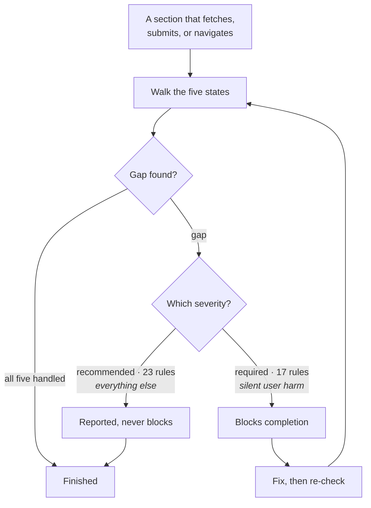

<div align="center">

# uilint

**A linter for the states everyone forgets — it refuses to call a component finished while its error
state is missing, and stays switched on because it blocks on only 17 of its own 40 rules.**

A Claude Code skill: 40 rules about interface behaviour, applied while the UI is written.
**No dependencies, no build step, nothing to run.**


<a href="LICENSE"></a>


<a href="SKILL.md">Skill</a> ·
<a href="docs/SPEC.md">Spec</a> ·
<a href="references/states.md">Rules</a>

</div>

---

## The five states

Ask an AI tool for a checkout form and you get one that works when the card clears, the network
holds, and the list already has data. The person building it clicks the buttons in the order that
succeeds, so the other paths never get written.

`uilint` walks five states against every section that fetches, submits, or navigates:

| State | The question it answers |
|---|---|
| **Loading** | Is something happening, and is it worth waiting for? |
| **Empty** | There is nothing here — is that broken, or just new? |
| **Error** | It failed. What failed, why, and what do I do now? |
| **Success** | Did it actually work? |
| **Partial** | Half of it loaded. Is the rest of the page still usable? |

Considered is not the same as present. A list that can never be empty needs no empty state — but
that has to be a decision, not an oversight.

## The gate that stays on

Most quality gates die the same way: they block on everything, someone has a deadline, and the gate
gets switched off permanently. So severity here is rationed. **17 rules block completion. The other
23 are reported and never block.**



`required` is reserved for **silent user harm**: no feedback at all, an error nobody can act on, a
dead end with no way forward, internal detail leaked on screen. Everything else reports. That ratio
is the design — a gate trusted enough to leave on is worth more than a stricter one that gets
disabled in week two.

Findings lead with what the user experiences, not which rule fired. *"A declined card currently
shows nothing at all"* lands; *"violates R-FEEDBACK-02"* does not.

**Every rule carries a check you can run in a minute** — all 40 of them, verified by counting: 40
rules, 40 `Why` lines, 40 `Applies` predicates, 40 `Check` steps, no exceptions.

```markdown
### R-STATE-12 · One failure must not blank the page
**DON'T:** Replace an entire screen with an error because a single section failed.
*Why:* The rest of the data arrived and is still useful. Discarding it turns a
partial outage into a total one.
*Applies:* screens with more than one data region
*Check:* force one request to reject. Is the remaining content still readable?
*Severity:* required
```

The `Applies` line is what stops false positives — the predicate that keeps a rule about
multi-region screens from firing on a single-panel one.

## A real run

Pointed at the front end of a working local tool: a 1,023-line vanilla-JS page that polls a Python
server every five seconds.

```text
Four required rules broken. All four are invisible by construction.

Blocking — 4 required:
  web/index.html:1019 · R-FEEDBACK-02
    The five-second poll swallows every failure: refresh().catch(() => {}).
    Kill the server and the page keeps showing stale numbers with no sign that
    it stopped updating.
    Fix: surface a disconnected marker after two consecutive failures

  web/index.html:917 · R-FEEDBACK-02
    es.onerror closes and reopens the event stream silently, so a dropped
    connection is invisible until someone notices progress has stopped.
    Fix: show a reconnecting state while the retry loop runs

  web/index.html:538 · R-STATE-02
    Every data panel ships empty - <div id="library"></div> - and the file
    contains no skeleton markup at all. A new user cannot tell an empty
    library from one that has not finished loading.
    Fix: render a skeleton until /api/state resolves at :873

  web/index.html:204 · R-STATE-15
    The remove-from-queue button sits at opacity: 0 until :hover. On a touch
    screen there is no hover, so the only way to clear a queued URL never
    appears at all.
    Fix: :focus-visible already covers keyboard - keep it visible on touch

Passed, deliberately: three disabled assignments (:601, :795, :988). Each is
either in flight or self-evident, which is what R-FORM-01 permits.
```

Three of those the previous version would also have caught. The fourth — `:204` — is the new
control-states rule seeing something the old 39 could not: a button that exists for a mouse and does
not exist for a thumb. **The three `disabled` assignments it walked past are the other half of the
same claim** — a gate that fires on everything teaches you to switch it off.

## Install

This repository is its own marketplace — nothing else to add first.

```bash
/plugin marketplace add DahanItamar/uilint
/plugin install uilint@uilint          # invokes as /uilint:uilint
```

Or clone it straight into your skills directory, which needs no plugin UI and so works in web and
cloud sessions too:

```bash
git clone https://github.com/DahanItamar/uilint.git ~/.claude/skills/uilint
```

```powershell
git clone https://github.com/DahanItamar/uilint.git "$env:USERPROFILE\.claude\skills\uilint"
```

Take the clone route if you want to edit the rules — a copy you own beats a cache you don't. Pick
one route, not both, or the same rules load twice. Restart Claude Code or run `/reload-plugins`
afterwards.

> [!IMPORTANT]
> **In the VS Code extension the command is `/plugins`, plural, and it opens a dialog.** The
> `/plugin` lines above are terminal-CLI syntax and do nothing there — they fail silently, which
> looks identical to the install not working. In the extension: `/plugins` → **Marketplaces** → add
> `DahanItamar/uilint` → **Plugins** → **uilint** → **Install**.

It also triggers on its own while you are building UI that fetches, submits, or navigates — or when
you describe a symptom rather than a category: *"nothing happens when I click"*, *"it just spins
forever"*, *"users don't know if it worked"*.

## Under the hood — briefly

- **Two files deep, on purpose.** [`SKILL.md`](SKILL.md) is 104 lines holding only the trigger, the
  checklist and the output contract. The 40 rules live in four reference files totalling 380 lines,
  loaded on demand — so a question about a form does not drag spinner thresholds and Tesler's Law
  into context.
- **Four domains.** [`states.md`](references/states.md) 13 · [`feedback.md`](references/feedback.md)
  9 · [`forms.md`](references/forms.md) 8 · [`laws.md`](references/laws.md) 10 — Jacob's, Hick's,
  Fitts's and Tesler's Laws, plus progressive disclosure.
- **Fixed rule shape.** DO or DON'T, never both; a mandatory *Why*; an `Applies` predicate; a
  runnable `Check`; a severity. Enforced across all 40, and no rule block exceeds 10 lines.
- **Permanent IDs, including retired ones.** `R-STATE-03` and `R-STATE-05` are no longer rules —
  their material merged into `R-STATE-06` and `R-STATE-04` — but the numbers are never reused, so an
  older review citing one still resolves to something.
- **The 40-rule ceiling is hard, and it held.** Parts 17 to 19 of the source series arrived wanting
  four new rules. Two pairs of existing rules merged to make room and a fifth new rule folded into
  one already there, so the set grew by one and the ceiling did not move.
  [`docs/SPEC.md`](docs/SPEC.md) §4 is the line that forced it.
- **Composes rather than competes.** It names `craft` for visual issues and `accessibility` for
  contrast and ARIA, and comments on neither itself.

> It deliberately does not touch spacing, colour, typography, elevation, or motion — those belong to
> the `craft` skill, whose own description disclaims UX flow. The two were built to leave each other
> alone. Design rationale is in [`docs/SPEC.md`](docs/SPEC.md).

## Credits

The behavioural rules were distilled from
**[@synsation_](https://www.instagram.com/synsation_/)**'s *Build for Good UX* series — a genuinely
practical walkthrough of the states and failure paths most tutorials skip. Version 1.2.0 folds in
parts 17 to 19: the six states of a button, the case against disabled submits, and Fitts's Law. If
these rules are useful to you, the series is worth your time.

They are independently written directives derived from that material; no transcripts or source text
appear in this repository. Jacob's Law, Hick's Law, Fitts's Law and Tesler's Law are long-established
principles, credited to Jakob Nielsen, William Hick, Paul Fitts and Larry Tesler.

---

<div align="center">

Built by <a href="https://github.com/DahanItamar">Itamar Dahan</a> · <a href="LICENSE">MIT</a> · © 2026

</div>
